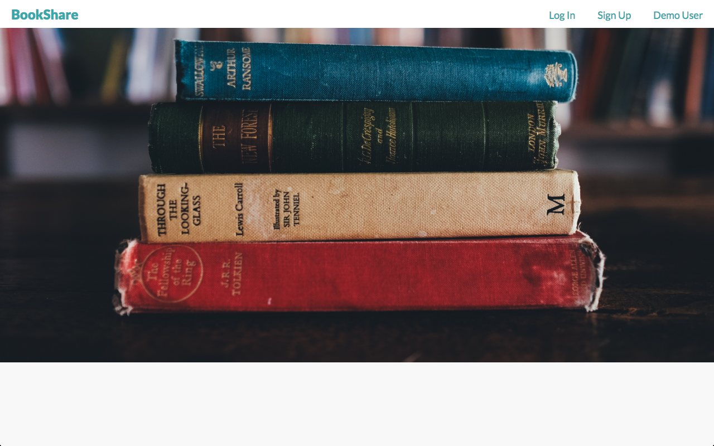
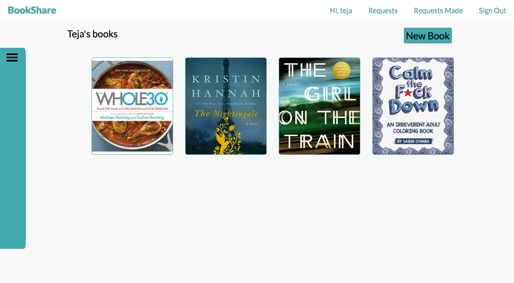

# BookShare

BookShare is a web application inspired by GoodReads built using Ruby on Rails and React.js. Users can view other users' book collections and request to borrow other users' books or approve or reject requests to borrow books.

Explore at [https://bookshares.herokuapp.com/][live]

[live]: https://bookshares.herokuapp.com/


## Welcome View:

[](https://bookshares.herokuapp.com/)

[home-page]: docs/images/home-page.png

## Project Page:



[landing-page]: docs/images/landing_page1.png

## Technical Details:

- BookShare allows users to put up books they own, and allows them to view and request other        users' books. Users can approve or cancel requests made to borrow their books.
Users are able to create, edit and delete books they own, and also make borrow requests on other users' books.
Users are able to view other users on the site, and request their books.
The book information is stored in a table and so is the borrowing information. The borrowings table stores information about the book, it's owner, the borrower, and the status of the request.
When a user chooses to view books they have requested, a SQL query is made to the data base that selects books by the borrower. When a user chooses to view requests made by other users to borrow their books, another SQL query is made to the database that filters books by the request-status of 'pending', and where the owner of the requested books is the currently logged in user.

```
def index
  if params[:asker] == "owner"
    # View borrowings where I am the owner
    @borrowings = Borrowing.where(owner_id: current_user.id,
    request_status: 'pending').includes(:book).includes(:borrower)
  else
    # View borrowings where I am the requester
    @borrowings = Borrowing.where(borrower_id: current_user.id,
    request_status: 'pending').includes(:book).includes(:owner)
  end
  render :index
end
```

## Features:

- Log in or Sign Up with email
- Guest login to allow users to explore the site
- View logged in users' books on home page
- Create edit and delete self's books
- View other users and their bookshelves
- Make borrow requests on other users' books
- View and approve or deny requests made on their books
- View requests that they have made on other users's books
- Disable borrow if a book has already been requested or borrowed
- Viewing images of book covers


##To-do:

- [ ] Users have friends, and can only view their books
- [ ] Enable each book to have multiple requests. User can approve or deny them.
- [ ] Search for books and users
- [ ] View friends or users within a certain geographical radius
- [ ] Enable book borrow requests to be made for a certain time duration
